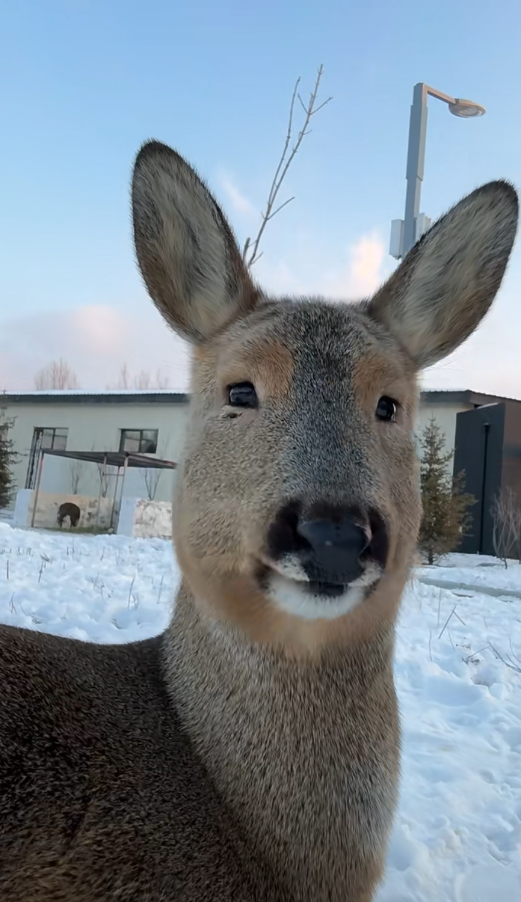
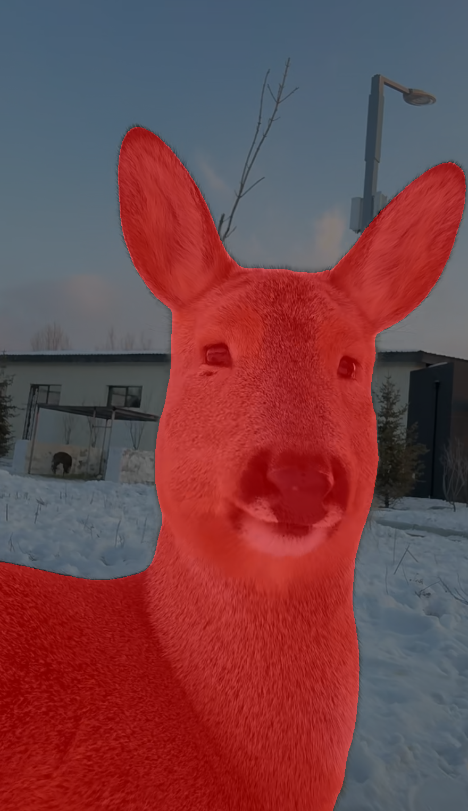

# Grounded-SAM-2 Web API

Web API service for image segmentation based on Grounded-SAM-2, supporting object detection and segmentation with natural language descriptions.

## Features

- 🚀 **REST API Interface** - Easy-to-use Web API
- 🔐 **Token Authentication** - Secure API access control
- 🔄 **Batch Processing** - Segment multiple objects in one request
- 📦 **Multiple Input Formats** - Support file paths, numpy arrays, PIL images

## File Structure

```
├── grounded_sam_webapi_server.py    # Web API server
├── grounded_sam_webapi_client.py    # Python client SDK
├── segmentation.py                  # Core segmentation module
├── README.md                       # Documentation
├── assets/                         # Reference images for testing
│   ├── deer.png                    # Test image, actually it is a eastern roe deer
│   ├── deer_mask.png               # Expected segmentation mask output
│   └── deer_overlay.png            # Expected overlay visualization
└── Grounded-SAM-2/                 # Grounded-SAM-2 repository (git clone)
    ├── checkpoints/                # SAM2 model checkpoints
    ├── gdino_checkpoints/          # Grounding DINO checkpoints
    └── ...                         
```

## Quick Start

### 1. Install Dependencies

```bash
# Create conda environment
conda create -n "groundedsam-webapi" python=3.10 -y
conda activate groundedsam-webapi
# Clone Grounded-SAM-2
git clone https://github.com/IDEA-Research/Grounded-SAM-2.git
cd Grounded-SAM-2/

# Install PyTorch and dependencies
pip install torch==2.5.1 torchvision==0.20.1 torchaudio==2.5.1 --index-url https://download.pytorch.org/whl/cu121
pip install -e .
pip install --no-build-isolation -e grounding_dino
pip install flask opencv-contrib-python-headless

# Download model files
cd checkpoints && bash download_ckpts.sh && cd ..
cd gdino_checkpoints && bash download_ckpts.sh && cd ..
```

### 2. Test Installation

```bash
# Test segmentation functionality
python segmentation.py
```

## Segmentation Demo Results

| Original | Segmentation Mask | Overlay |
|----------|-------------------|---------|
|  |  |  |

### 3. Start Server

```bash
# Set token and start service
export API_TOKEN="your-secure-token"
python grounded_sam_webapi_server.py
```

## Usage Examples

### Python Client

```python
from grounded_sam_webapi_client import GroundedSAMClient

# Initialize client
client = GroundedSAMClient(
    base_url="http://localhost:5000",
    token="your-secure-token"
)

# Single object segmentation
result = client.segment_object(
    image="deer.png",
    text_prompt="deer"
)

# Parse results
if result["success"]:
    masks = result["masks"]          # List of base64 encoded masks
    bboxes = result["bboxes"]        # List of bounding boxes [[x1,y1,x2,y2]]
    scores = result["scores"]        # List of confidence scores
    phrases = result["phrases"]      # List of detected phrases
    
    print(f"Found {len(masks)} objects")
    for i, (bbox, score, phrase) in enumerate(zip(bboxes, scores, phrases)):
        print(f"Object {i}: {phrase} (score: {score:.3f}, bbox: {bbox})")

# Batch segmentation
batch_result = client.batch_segment_objects(
    image="deer.png", 
    text_prompts=["deer", "tree", "grass"]
)

# Parse batch results
for prompt, result in batch_result.items():
    if prompt == "success":  # Skip the overall success flag
        continue
    if result["success"]:
        masks = result["masks"]
        bboxes = result["bboxes"] 
        scores = result["scores"]
        print(f"'{prompt}': found {len(masks)} objects")
```

### cURL Commands

```bash
# Health check
curl -H "Authorization: Bearer your-secure-token" \
     http://localhost:5000/health

# Single object segmentation
curl -X POST http://localhost:5000/segment \
  -H "Content-Type: application/json" \
  -H "Authorization: Bearer your-secure-token" \
  -d '{
    "image": "base64_encoded_image",
    "text_prompt": "deer"
  }'
```

---

## API Documentation

### Endpoints

| Method | Path | Description | Auth |
|--------|------|-------------|------|
| GET | `/health` | Health check | Optional |
| POST | `/segment` | Single object segmentation | Required |
| POST | `/batch_segment` | Batch segmentation | Required |
### Request Format

#### POST /segment - Single Object Segmentation

```json
{
  "image": "base64_encoded_image",
  "text_prompt": "deer",
  "box_threshold": 0.3,
  "text_threshold": 0.25
}
```

#### POST /batch_segment - Batch Segmentation

```json
{
  "image": "base64_encoded_image", 
  "text_prompts": ["deer", "tree", "grass"]
}
```

### Response Format

#### Single Object Segmentation Response

```json
{
  "success": true,
  "bboxes": [[x1, y1, x2, y2]],
  "masks": ["base64_encoded_mask"],
  "phrases": ["detected_phrase"],
  "scores": [confidence_score]
}
```

#### Batch Segmentation Response

```json
{
  "success": true,
  "deer": {
    "success": true,
    "masks": ["base64_encoded_mask"],
    "bboxes": [[x1, y1, x2, y2]],
    "scores": [confidence_score],
    "phrases": ["deer"]
  },
  "tree": {
    "success": true,
    "masks": ["base64_encoded_mask"],
    "bboxes": [[x1, y1, x2, y2]],
    "scores": [confidence_score],
    "phrases": ["tree"]
  }
}
```

### Authentication

All API endpoints (except basic health check) require a Bearer token in the request header:

```
Authorization: Bearer your-secure-token
```


## Contributing

We welcome contributions! Whether you're fixing bugs, adding features, or improving documentation, your help is appreciated.

1. **Fork** this repository
2. **Create** a feature branch (`git checkout -b feature/amazing-feature`)
3. **Commit** your changes (`git commit -m 'Add amazing feature'`)
4. **Push** to the branch (`git push origin feature/amazing-feature`)
5. **Open** a Pull Request

## Disclaimer

This project is provided "as is" without warranty of any kind. Use at your own risk.

If you use this project in your research or applications, please mention the source: https://github.com/YipKo/Grounded-SAM-2-Web-API

## Acknowledgments

- [Grounded-SAM-2](https://github.com/IDEA-Research/Grounded-SAM-2) - Core segmentation model
- [SAM2](https://github.com/facebookresearch/sam2) - Segment Anything Model 2
- [Grounding DINO](https://github.com/IDEA-Research/GroundingDINO) - Object detection with natural language
